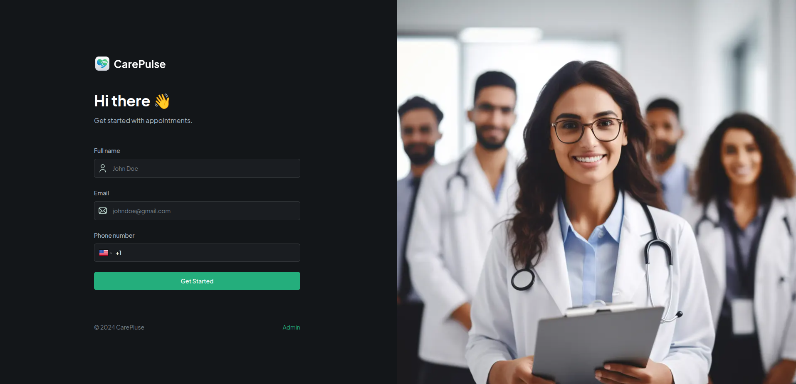

<div align="center">

<br />
<h1>CarePulse</h1>
<p>A Modern Healthcare Patient Management System</p>

<div>


</div>
<br />
</div>

## 📖 Table of Contents

- [About The Project](#-about-the-project)
- [⚙️ Tech Stack](#️-tech-stack)
- [🔋 Features](#-features)
- [🤸 Getting Started](#-getting-started)
  - [Prerequisites](#prerequisites)
  - [Installation](#installation)
  - [Environment Variables](#environment-variables)
  - [Running the Application](#running-the-application)
- [📁 Folder Structure](#-folder-structure)
- [🤝 Contributing](#-contributing)
- [🧑‍💻 Author](#-author)

### 🤖 About The Project
CarePulse is a comprehensive healthcare patient management application designed to streamline the process of patient-doctor interactions. It provides a seamless platform for patients to register, book appointments, and manage their health records. For administrators, it offers a powerful dashboard to oversee scheduling, confirm or cancel appointments, and communicate effectively with patients through integrated SMS notifications.

Built with a modern tech stack centered around Next.js and Appwrite, CarePulse focuses on performance, scalability, and an excellent user experience.

<br>

### ⚙️ Tech Stack
This project is built using a modern and robust set of technologies:

```
Framework: Next.js

Backend & Database: Appwrite

Language: TypeScript

Styling: TailwindCSS

UI Components: ShadCN

SMS Notifications: Twilio

Error Tracking: Sentry
```

🔋 Features
👉 Patient Registration: Secure and easy sign-up process for new patients to create their profiles.

👉 Appointment Booking: Intuitive interface for patients to schedule new appointments with available doctors.

👉 Admin Dashboard: A centralized dashboard for administrators to view, filter, and manage all scheduled appointments.

👉 Appointment Management: Admins can confirm, reschedule, or cancel appointments directly from the dashboard.

👉 SMS Notifications: Automated SMS alerts are sent to patients upon appointment confirmation, keeping them informed.

👉 File Uploads: Secure file handling using Appwrite Storage for medical records, lab results, and other documents.

👉 Performance Monitoring: Integrated with Sentry to proactively track application performance and catch errors in real-time.

👉 Responsive Design: Fully responsive layout ensuring a seamless experience on desktops, tablets, and mobile devices.

👉 Scalable Architecture: Built with a focus on code reusability and a scalable structure to accommodate future growth.

### 🤸 Getting Started
Follow these instructions to set up and run the project on your local machine.

### Prerequisites
Ensure you have the following software installed:
```
Git

Node.js (v18.x or later)

npm (Node Package Manager)
```

### Installation
###### Clone the Repository

```
Bash

git clone https://github.com/codewithsaidul/care-pulse.git
cd care-pulse
```
Install Dependencies


```
Bash

npm install
```

Environment Variables
Create a .env.local file in the root of your project and populate it with your credentials. You can obtain the Appwrite keys from your Appwrite Console.

Code snippet

# Appwrite Configuration
```
NEXT_PUBLIC_ENDPOINT=https://cloud.appwrite.io/v1
PROJECT_ID=your_appwrite_project_id
API_KEY=your_appwrite_api_key
DATABASE_ID=your_appwrite_database_id
PATIENT_COLLECTION_ID=your_patient_collection_id
DOCTOR_COLLECTION_ID=your_doctor_collection_id
APPOINTMENT_COLLECTION_ID=your_appointment_collection_id
NEXT_PUBLIC_BUCKET_ID=your_storage_bucket_id

# Admin Passkey for Admin Dashboard Access
NEXT_PUBLIC_ADMIN_PASSKEY=your_secure_admin_passkey

```
Running the Application
Once the installation and environment setup are complete, run the development server:
```
Bash
npm run dev
```
Open your browser and navigate to http://localhost:3000 to see the application in action.


```
📁 Folder Structure
Here is the high-level overview of the project's structure.

care-pulse/
├── app/
│   ├── (pages)/              # Main application routes using Next.js App Router
│   │   ├── admin/            # Admin dashboard page
│   │   └── patients/         # Patient-specific routes
│   ├── api/                  # API routes
│   ├── layout.tsx            # Root layout
│   └── globals.css           # Global styles
├── components/
│   ├── forms/                # Reusable form components
│   ├── table/                # Components for data tables
│   ├── ui/                   # UI primitives from ShadCN
│   └── *.tsx                 # Other reusable components
├── constants/
│   └── index.ts              # Application-wide constants
├── lib/
│   ├── actions/              # Server actions for mutations
│   ├── appwrite.ts           # Appwrite client configuration
│   └── utils.ts              # Utility functions
├── public/
│   ├── assets/               # Static assets like images and icons
│   └── favicon.ico
├── types/
│   ├── appwrite.types.ts     # Types related to Appwrite models
│   └── index.d.ts            # Global type definitions
├── .env.local                # Environment variables (untracked)
├── next.config.mjs           # Next.js configuration
└── package.json              # Project dependencies and scripts

```
### 🤝 Contributing
Contributions are what make the open-source community such an amazing place to learn, inspire, and create. Any contributions you make are greatly appreciated.

If you have a suggestion that would make this better, please fork the repo and create a pull request. You can also simply open an issue with the tag "enhancement".

### Fork the Project

  - Create your Feature Branch (git checkout -b feature/AmazingFeature)

  - Commit your Changes (git commit -m 'Add some AmazingFeature')

  - Push to the Branch (git push origin feature/AmazingFeature)

  - Open a Pull Request


## 🧑‍💻 Author

##### SAIDUL ISLAM RANA

Frontend Dev | Backend Learner | MERN Stack Enthusiast
<br>
GitHub: @codewithsaidul
LinkedIn: @codewithsaidul
